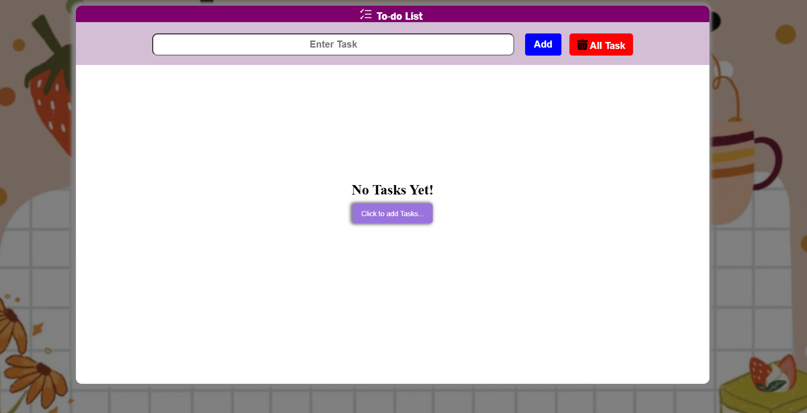
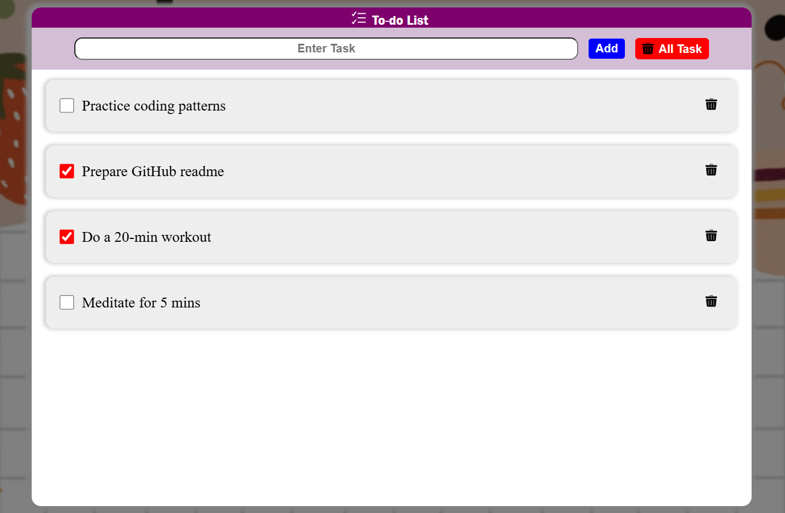

# ✅ To-Do List App  

A simple and responsive **To-Do List application** built with **HTML, CSS, and JavaScript**, allowing users to add, delete, and mark tasks as complete.  

---

## 🚀 Live Demo  
🔗 https://askpundir-dev.github.io/todo-list-app/

---

## 📌 Features  
- ➕ Add new tasks  
- ✅ Mark tasks as complete  
- ❌ Delete tasks  
- 💾 Persistent storage with localStorage  
- 📱 Responsive design  

---

## 🛠️ Tech Stack  
- **HTML5** – Structure  
- **CSS3** – Styling  
- **JavaScript (ES6)** – Functionality  

---

## 📸 Screenshots  

### Main Interface  

